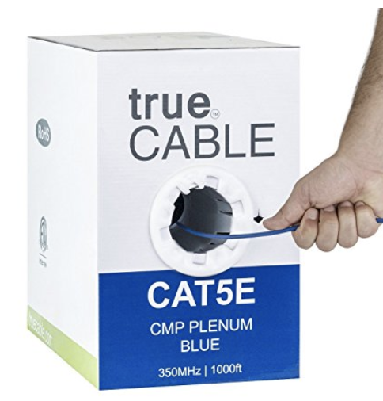

# Lab 4

This lab was done by Jonathan De leon and Matthew Ma as part of the *CPTR 210 Data Communications and Networks* lab assignment.

## Background

The local doctor has decided to add an IP Based phone system and several printers. 
He wants to add printers to all the offices and one at the front desk. 
Also each room should be wired for a phone. 
The phone system will be added to the server rack.

The doctor asks for a design for the different subnets for each type of devices.

## Equipment Needed
There will be about 10 computers on LAN network connecting to the wall outlets. In addition, the phones and printers will be connected to the wall outlets. The pricing and tools are detailed below. 

* Wall outlets
  * [$12.99 Cat5e Keystone Jack](http://a.co/0o8JcXL)
  * [$9.99 Wall Plate](http://a.co/d0aJYTN)
  * [$6.82 Phone/Ethernet Wall Plate](http://a.co/gDBew2Y)  
  
* Cabling
  * [$159.99 Cat5e Plenum Cabling](http://a.co/8aBYFJ2)  
  
* Switches
  * [$116.94 Cisco 10-port Gigabit Managed Switch](http://a.co/2clLWWc)  
  

### Tools Needed

* Crimper, Cutter, Strip Tool
  * [$16.59 TRENDnet Crimper](http://a.co/1aG1ykZ)
* Hammer
  * [$14.21 Stanley Hammer](http://a.co/8KdXjKl)
* Screwdriver
  * [$14.97 Screwdriver Set](http://a.co/cMmgKDS)

## IP Address Assignment
* Subnet for Printers
  * Network ID: 192.168.0.0/26
  * Host Range: (192.168.0.1-192.168.0.62)
  * Broadcast Address: 192.168.0.63
* Subnet for Phones
  * Network ID: 192.168.0.64/26
  * Host Range: (192.168.0.65-192.168.0.126)
  * Broadcast Address: 192.168.0.127
* Subnet for Computers
  * Network ID: 192.168.0.128/26
  * Host Range: (192.168.0.129-192.168.0.190)
  * Broadcast Address: 192.168.0.191

## Design Layout

* Legend
  * Red Dots - Printers
  * Blue Ovals - Phones
  * Blue Cross - Phone System
  * Orange Line - New Wiring
  * Grey Circles - Servers
  * Black Lines - Old Wiring

## Contributors
* @delejo
* @mamatt