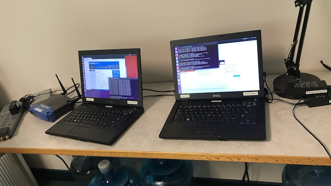
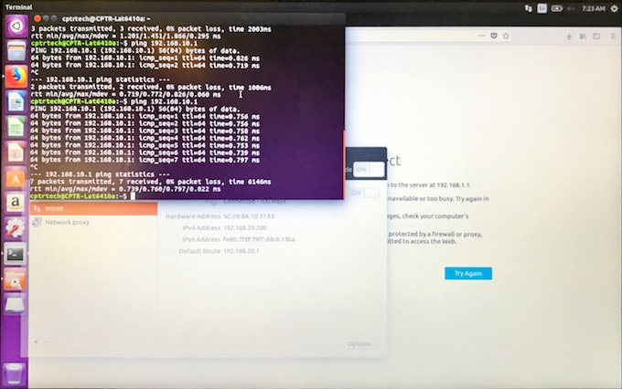
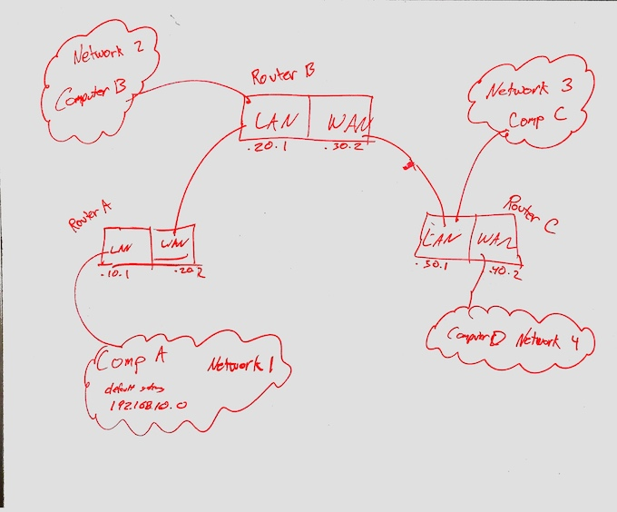
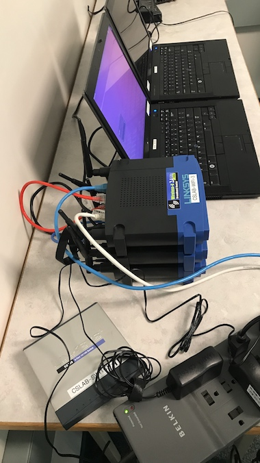
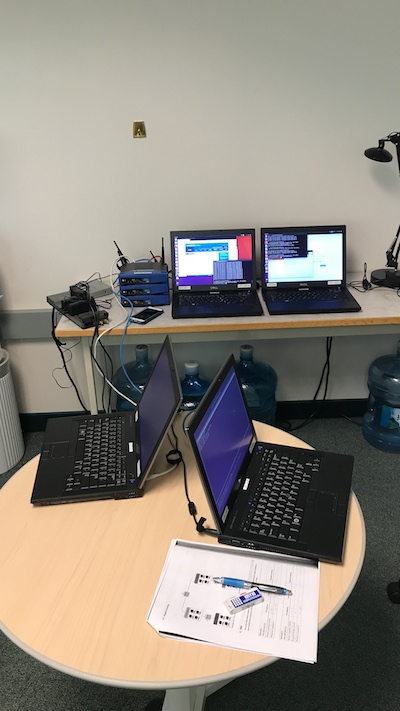
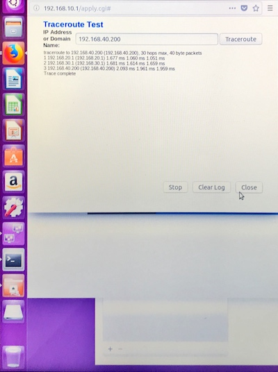

# Lab 5

This lab was done by Jonathan De leon and Jaydee Sereewit as part of the *CPTR 210 Data Communications and Networks* lab assignment.

## Background

This lab required us to install and configure routers in a closed private network. It was a two step process with the first step configuring one router and the second step configuring multiple (3) routers and setting up dynamic routing protocols. By doing this lab, we learned to configure multiple interfaces on Ethernet routers, physically install router hardware, implement a two-network infrastructure, implement static routes in routers, define components in the routing table, and implement a dynamic routing protocol.

## Equipment Needed
This lab was done using the Linksys WRT54G routers and 4 laptop machines.

## Installing One Router
In this portion of the lab, we connected two networks to one router. One network was connected via LAN, while the other was connected via WAN.

* Network 1 (LAN) : `192.168.10.0/24`
* Network 2 (WAN) : `192.168.20.0/24`

After configuring the router, we tested the communication by sending *ping* signals back and forth. 

### Photos

## Multiple Routers and Dynamic Routing

In the final portion of the lab, we connected four networks together using three routers. We tested communication via *ping* with the default routing and found that it was not possible to communicate from `Network 1` to `Network 4` without alterting the routing tables or adding a dynamic routing protocol. By adding the **RIP** protocol, we were able to successfully communicate between all computers of the interconnected network.

The network was laid out as follows:

* Network 1 (Router A LAN) : `192.168.10.0/24`
* Network 2 (Router A WAN --> Router B LAN) : `192.168.20.0/24`
* Network 3 (Router B WAN --> Router C LAN) : `192.168.30.0/24`
* Network 4 (Router C WAN) : `192.168.40.0/24`

### Setup Photos

## Contributors
* @delejo
* @sereja1