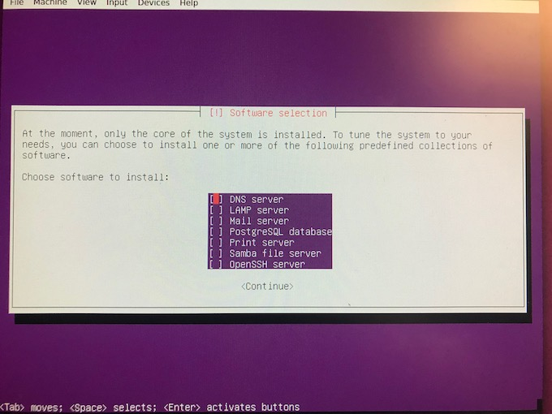
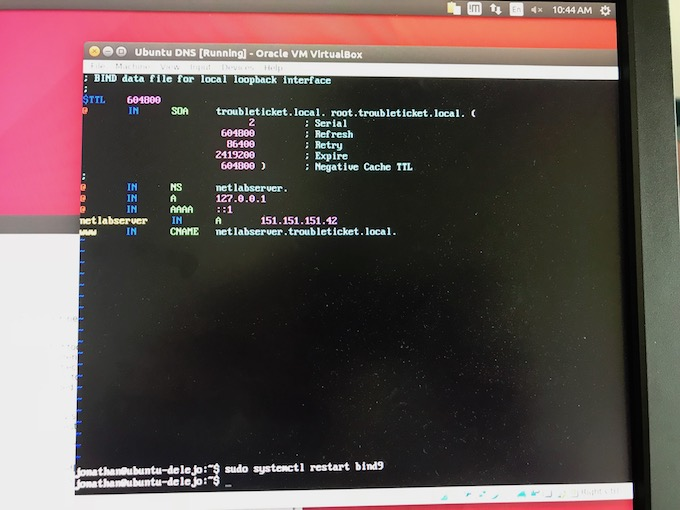
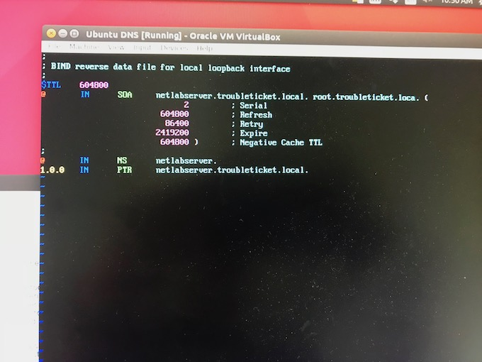

# Lab 6

This lab was done by Jonathan De leon as part of the *CPTR 210 Data Communications and Networks* lab assignment.

## Background

This lab required us to install and configure DNS servers and clients.

The Lab Exercises recommended the use of Windows Server 2012 to install the DNS server. I used the Ubuntu 18.04 operating system and installed a DNS BIND (Berkley Internet Name Domain) server on a virtual machine.

## Installing DNS

The Ubuntu 18.04 Server installation gives the ability to download and install the default DNS server packages necessary to run a DNS server. 



I had some difficulty locating the DNS configuration files after the installation was complete. It is possible that I did not choose correctly. Regardless, I manually installed BIND via the following command

```
$ sudo apt install bind9 dnsutils
```

## Configuring DNS

After installing the DNS BIND server, I followed this helpful [Ubuntu guide](https://help.ubuntu.com/lts/serverguide/dns.html.en) to configure my server.

The configuration files were located at the `/etc/bind` directory.

### Primary Zone
I created the `troubleticket.local` zone necessary to complete the lab assignment and added the records as required by the lab.



### Reverse Lookup Nameserver

I added the `netserver.troubleticket.local` nameserver zone configurations.



## Testing DNS server

Ideally, the DNS server should be responding to queries. I wasn't able to ping, dig, or nslookup the dns server. I believe that it's due to the IP address configurations in the DNS configs. The lab mentioned to add a configuration to allow some DNS configuration, but I couldn't find how to do it on Ubuntu. Nonetheless, the lab was updated to only do the first portion which was completed.

## Contributors
* @delejo
