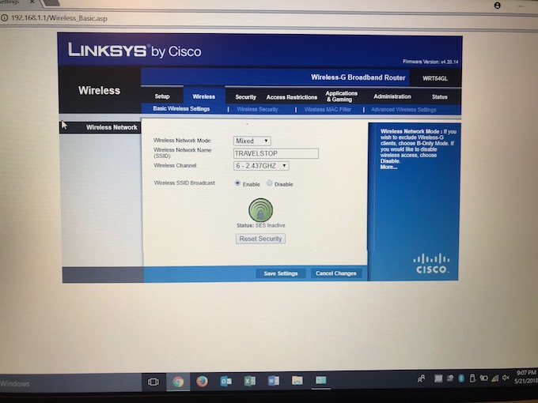
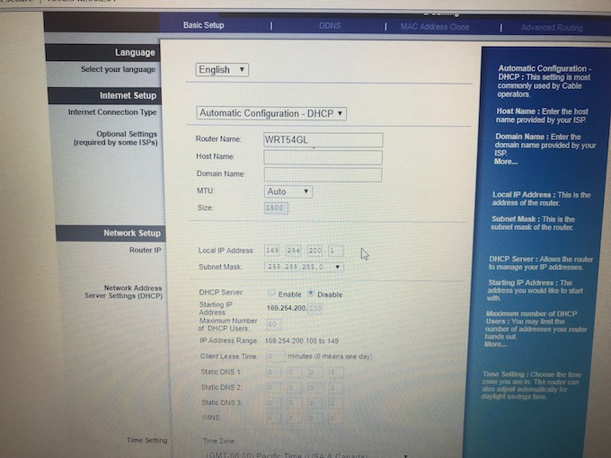
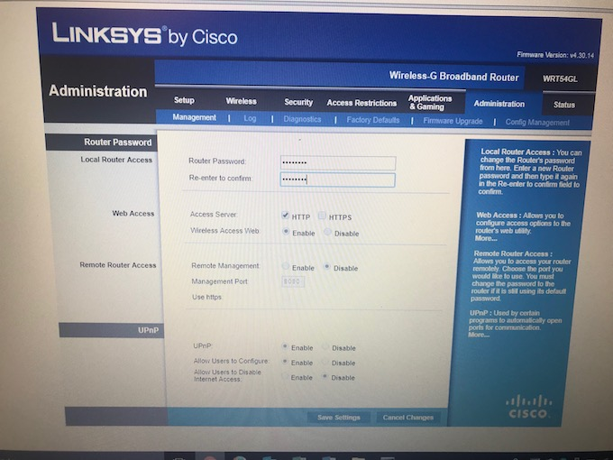
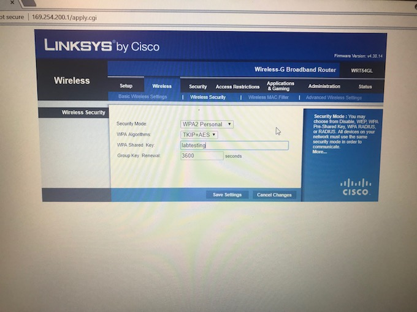
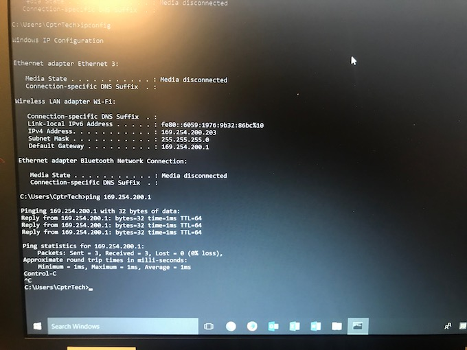

# Lab 6

This lab was done by Jonathan De leon as part of the *CPTR 210 Data Communications and Networks* lab assignment.

## Background

This lab required us to install and configure a wireless network.

The lab was completed using a Linksys WRT54GL router.

## Configuring Wireless Network

Before we begin configuring the router, it is necessary to reset the router to factory defaults.

The goal of the configuration is to configure the wireless network to operate in infrastructure mode where wireless network nodes can connect to a wired segment.

Prior to connecting the wireless access point to the wired segment, we must configure some settings so that it does not interfere with the wired network infrastructure. 

### SSID
Router SSID was changed to `TRAVELSTOP`

### IP Address

The wired network had a `169.254.0.0/16` network ID configuration. To avoid any collisions, the WAP was assigned an IP out of the DHCP range and the WAP's DHCP server was turned off.

Router IP Address:

* `169.254.200.1`

### Security

To bring security up to an acceptable level, the configuration utility admin password was configured and WPA2-Personal encryption was enabled.

### Testing configuration

Now that the WAP is connected to the wireless segment, we must test the configuration settings by connecting a wireless node to the WAP. The WAP's DHCP server was turned off so we had to manually configure the node's configuration settings to access the WAP. The local machine had the IP address `169.254.200.203` and is shown to be able to successfully ping the router.

## Contributors
* @delejo