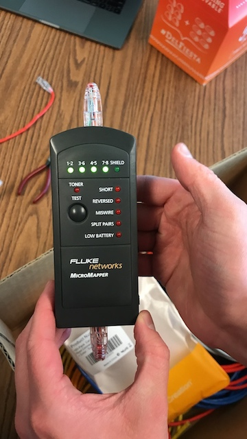
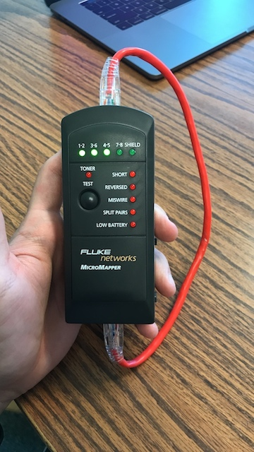
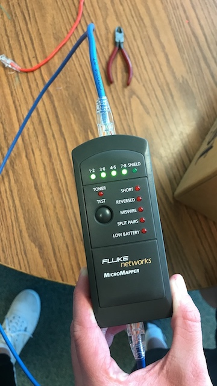
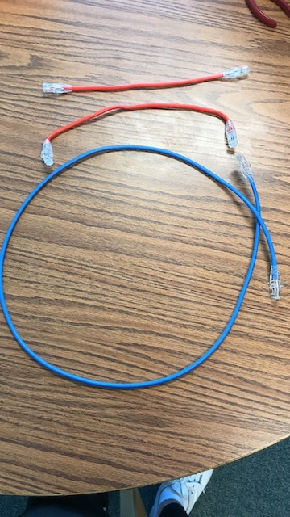

# Lab 2 Report
This lab was done by Jonathan De leon and Stefan Hess as part of the *CPTR 210 Data Communications and Networks* lab assignment.

## Background
The lab was focused on making and testing RJ-45 ethernet cables.

## Networking Cabling Tutorial
[CNet](https://www.cnet.com/how-to/how-to-make-your-own-ethernet-cable/) has a nice walkthrough on how to create cables.

## Process
1. We both created and tested our own 1' working cables.
  * Stefan's Cable:   

  * Jonathan's Cable:    

2. As a group, we created one 4' working cable.  

### All Cables

## Contributors
* @hessst
* @delejo
