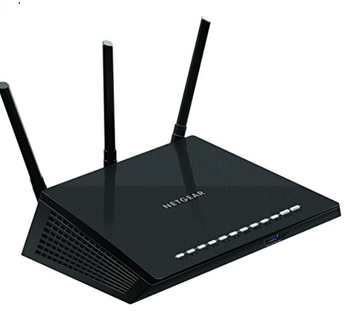
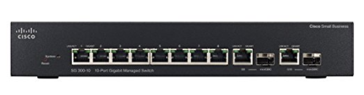
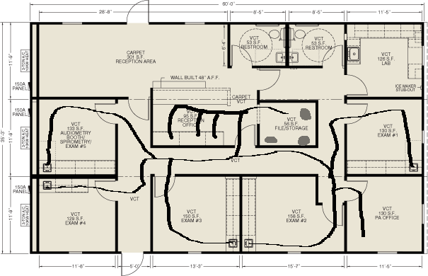

# Lab 3

This lab was done by Jonathan De leon and Matthew Ma as part of the *CPTR 210 Data Communications and Networks* lab assignment.

## Background

A local doctor has come to you for advice on how to set up his office network.
He states he wants three computers at the reception and one computer in each of the offices and exam rooms.
The office software runs on a three servers that can be install in any room.
The local ISP says they can run the internet connection to any designated room.

The doctor askes for a list of tools needed for the job so he could possibly install it himself

## Equipment Needed
There will be about 10 computers on LAN network connecting to the wall outlets. There is also a router for the reception room so that guests can use the network to access the internet. The pricing and tools are detailed below. 

* Wall outlets
  * [$12.99 Cat5e Keystone Jack](http://a.co/0o8JcXL)
  * [$9.99 Wall Plate](http://a.co/d0aJYTN)
* Cabling
  * [$159.99 Cat5e Plenum Cabling](http://a.co/8aBYFJ2)
  
* Router
  * [$99.99 NETGEAR R6700 Nighthawk](http://a.co/abbiKHe)
  
* Switches
  * [$116.94 Cisco 10-port Gigabit Managed Switch](http://a.co/2clLWWc)
  

### Tools Needed

* Crimper, Cutter, Strip Tool
  * [$16.59 TRENDnet Crimper](http://a.co/1aG1ykZ)
* Hammer
  * [$14.21 Stanley Hammer](http://a.co/8KdXjKl)
* Screwdriver
  * [$14.97 Screwdriver Set](http://a.co/cMmgKDS)

## Design Layout

Things to note:

* The network should have at least two subnets for security reasons and on a Class C network.
* The three servers are located in the file storage closet.
* Each office has a computer and the reception office has three computers.
* Cables are routed through the ceiling using the plenum grade Cat5e cabling.
* Router is located in the reception office.

## Contributors
* @delejo
* @mamatt